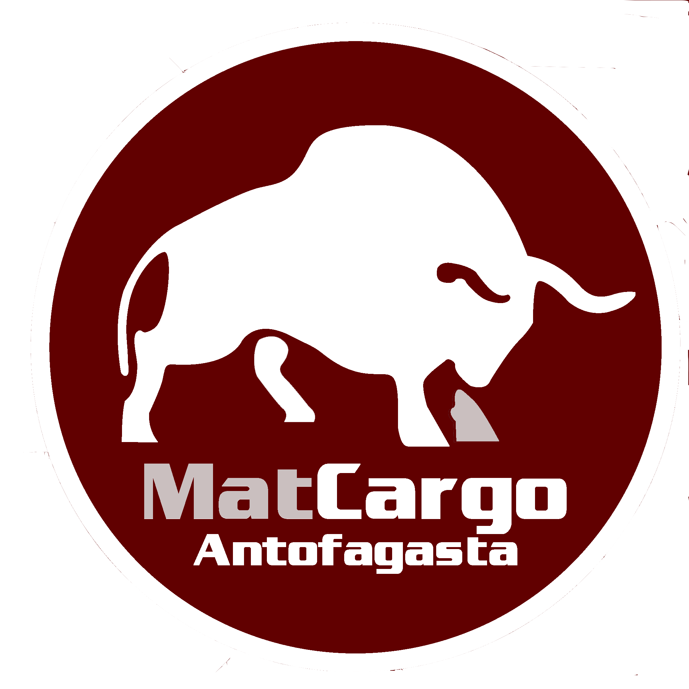
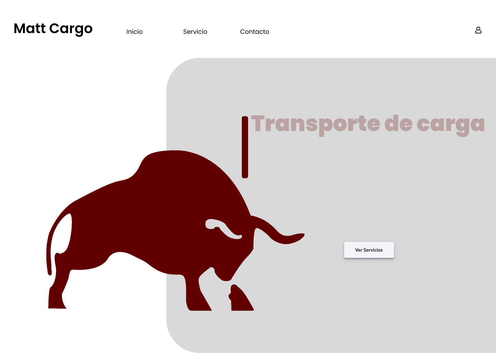

# Aplicación Web Matt Cargo

## Qué es Matcargo?

Es una empresa de transporte que se especializa en el traslado de mercancías y productos en todo el territorio nacional
Funciones de la empresa
Apoyo a sus operaciones directamente desde las regiones del norte de Chile.
Tratamiento y seguimiento personalizado de todos sus requerimientos.
Servicios door to door con constante seguimiento de la carga a través de GPS y comunicación móvil.

## Funcionalidades de aplicación

Registro de usuarios
Cotizacion de servicios
Compra de servicio
Panel de administración para usuario ,consulta de cotizaciones y servicios adquiridos

## logo

## Paleta de colores

## Color Reference

| Color   | Hex                                                              |
| ------- | ---------------------------------------------------------------- |
| Granate |  #610000 |
| Blanco  |  #ffffff |
| Gris    |  #cabfbf |

-Granate:#610000
-Blanco:#ffffff
#-Gris:#cabfbf

##

## Referencias

## Tecnologías utilizadas

HTML, CSS y JavaScript para el front-end
